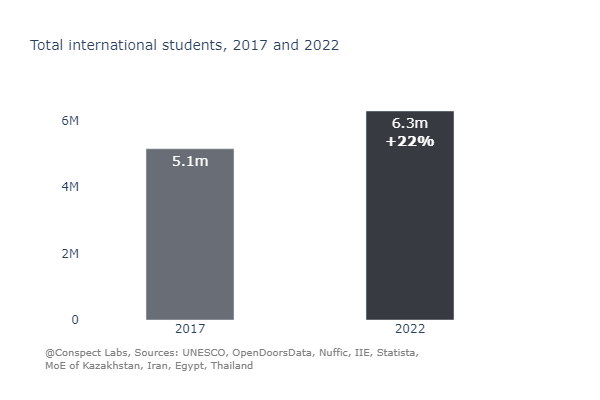
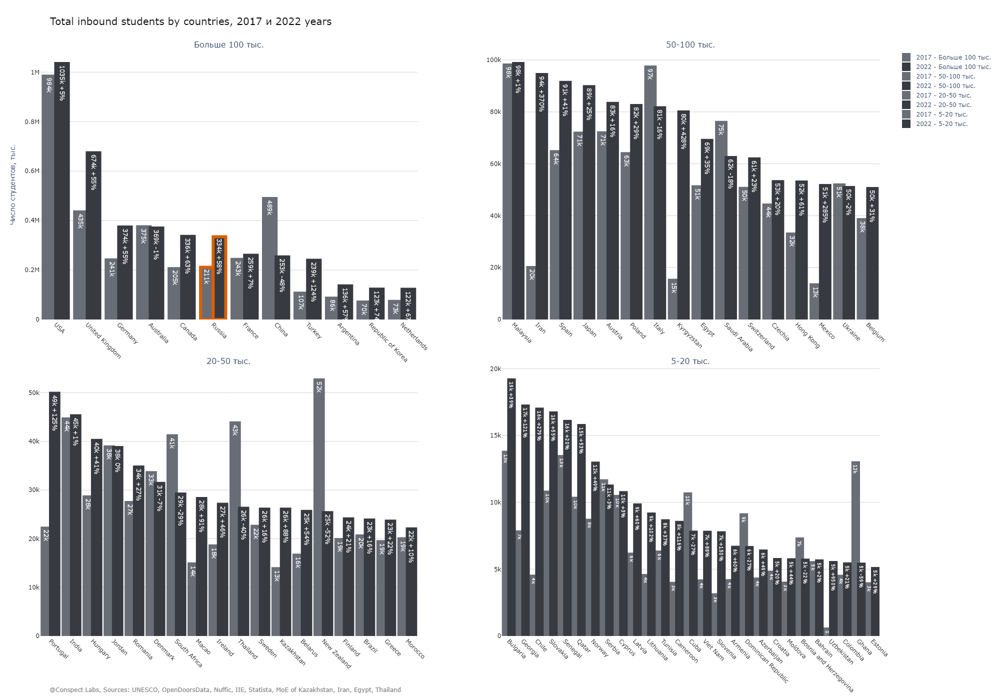
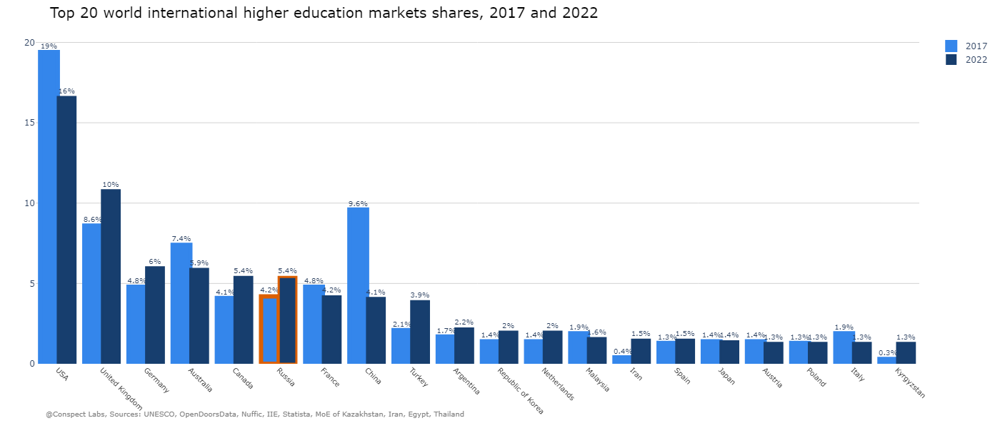
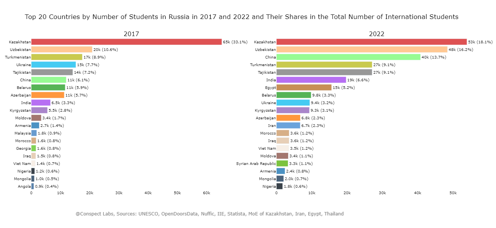
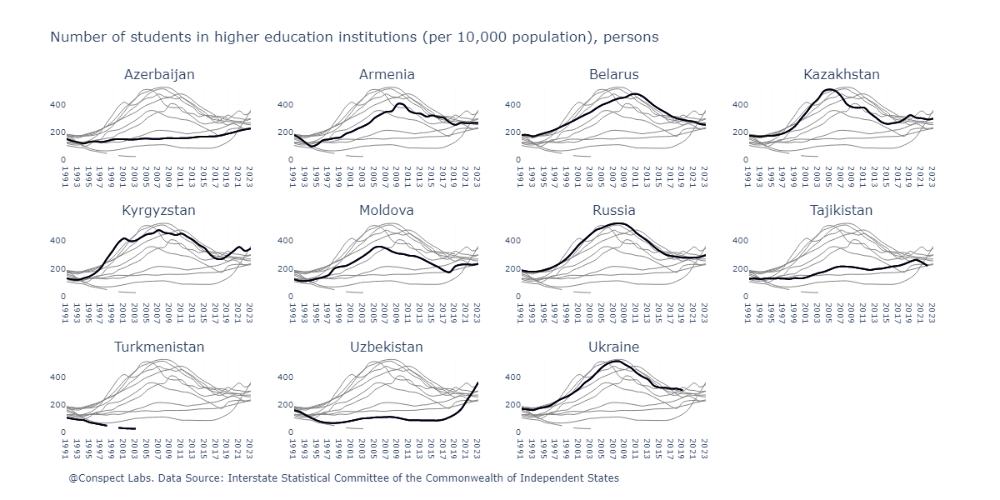
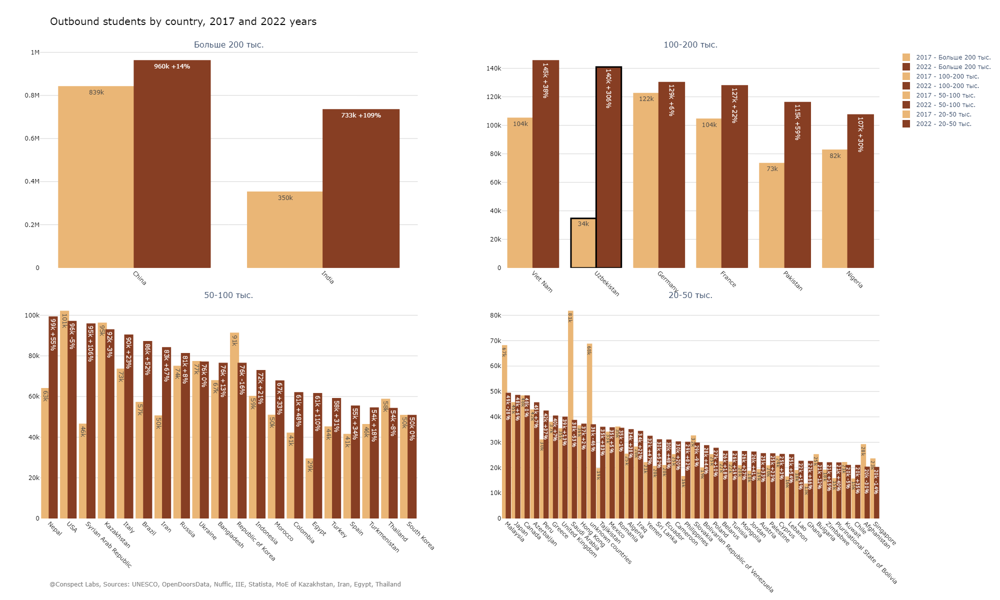
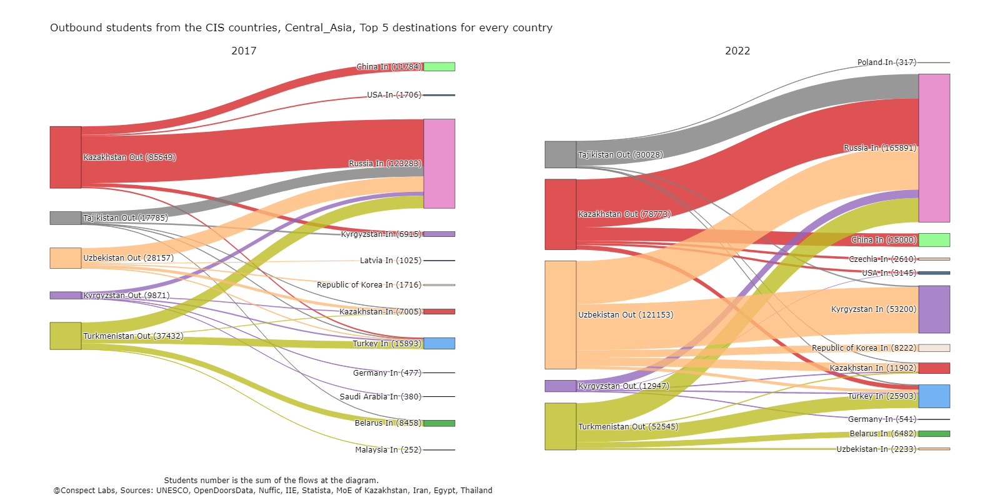
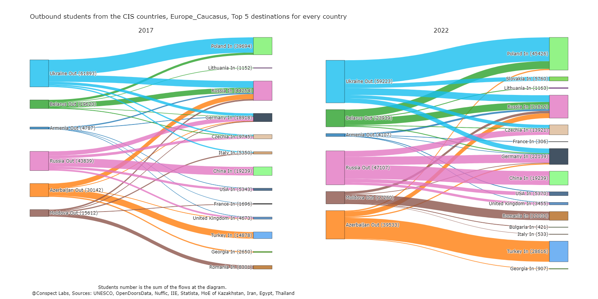
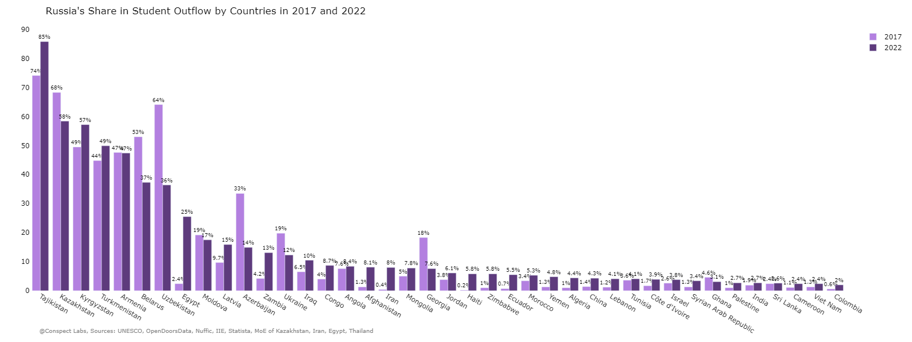

<h2>What's this about</h2>
This repository contains a notebook, additional data, charts, and an article aimed at finding, exploring, and examining trends in the international higher education market based on data from UNESCO and individual countries, primarily focusing on the cluster of Russia, Central Asia, and other CIS countries.

<h2>Jupyter Notebook</h2>
<a href='https://github.com/YuliyaTorgasheva/students_mobility/blob/main/international_students_mob_CA.ipynb'>Jupyter Notebook with data ETL and diagrams</a>

<h2>Data Sources</h2>

UNESCO Bulk Data Download Service can be accessed here: <a href>https://uis.unesco.org/bdds</a> 
  Labels list is analyzed and students inbound indicators are extracted into distinct csv file named <i>OPRI_student_labels.csv</i>
 UNESCO Data Service is also availabla at <a href>https://data.uis.unesco.org/#</a> 

UNESCO UIS DataSet for 2017 and 2022 lacks reports, for several years, from USA, Mexico, Netherlands, Iran, Kazakhstan and some other countries. They are taken from the following sources:
  USA, 2022 - <a href>https://opendoorsdata.org</a> (by source countries)
 China, 2022 - <a href>http://www.moe.gov.cn/jyb_xwfb/gzdt_gzdt/s5987/201904/t20190412_377692.html</a>  taken pre-pandemic for distinct countries, in total from <a href>http://en.moe.gov.cn/documents/statistics/2022/national/202401/t20240110_1099530.html</a>  for the 2022
 China, 2017 - are from 2018 <a href>https://docs.aiddata.org/reports/corridors-of-power.html#figure4</a> 
 Philippines - still absent
 Israel - still absent
  Netherlands, 2022 - <a href>https://www.nuffic.nl/sites/default/files/2023-06/incoming-degree-mobility-in-dutch-higher-education-2022-2023.pdf</a>  (total and by source countries where provided)
  Mexico, 2022 - <a href>https://www.iie.org/research-initiatives/project-atlas/explore-data/mexico-2/</a>  (total inbound students)
  Iran, 2022 - <a href>https://tehrantimes.com/news/483478/Students-from-91-countries-studying-in-Iranian-universities</a>  (total inbound students)
  Kazakhstan, 2022 - <a href>https://enic-kazakhstan.edu.kz/uploads/additional_files_items/193/file/tadzhikistan.pdf?cache=1691397957</a> , https://enic-kazakhstan.edu.kz/uploads/additional_files_items/156/file/</a> mezhdunarodnoe-sotrudnichestvo-sng.pdf?cache=1677496628</a> , <a href>https://enic-kazakhstan.edu.kz/uploads/additional_files_items/138/file/3-1-monitoring-akademicheskoy-mobilnosti-2022-rus.pdf?cache=1672983807</a>  (total and by source countries where provided)
  Egypt, 2017 - <a href>https://enterprise.press/stories/2019/12/16/how-egypt-is-positioning-itself-as-an-educational-hub-for-international-students-8512/</a>  (total inbound students)
  Thailand, 2017 - <a href>https://apheit.bu.ac.th/jounal/Inter-vol8-1/นานาชาติ_บทความวิจัย_2.pdf</a>  (total inbound students)
 ! Important disclaimer: China has been publishing very poor data on incoming student numbers lately so we only know total volumes entering foreign students into China along with data on arrivals from specific countries. For missing countries I used data from 2017. There are no such problems with student imports from China; we can confidently rely on those figures. The main dataset comes from UNESCO but data for absent countries have been supplemented with information from other usually trusted sources.

<h2>Trends in ISM in Central Asia, Russia and CIS Countries // Where students from CIS countries go to study</h2>
<h3>Uzbek bachelors changed the whole Central Asia higher education market</h3>

<i>It’s like some sleeping giant has awakened. This has significantly changed the dynamics in the higher education market in the Central Asia cluster, where Russia's position is now far from monopolistic; Central Asian countries are becoming educational hubs themselves, and Turkey is catching up with everyone. What is happening?</i>

Let’s start with the world. Russia consistently ranks 6th to 7th in the world for student imports. In recent years, it has been growing faster than the overall market. While globally, the number of international students increased by 22% over the last five years (from 2017 to 2022) — from 5.1 million to 6.3 million people, in Russia, the increase was 60% — from 211 thousand to 334 thousand people. (Note: Here and below, the number of foreign students per year refers to students of all courses, not just those admitted that year.)

However, other market leaders (except for the current leader — the USA) have also grown at similar rates — Germany, Canada, and the UK, while Turkey has grown much faster — more than twice as much. The post-COVID world is catching up: among countries with an influx of 100,000 students are Argentina, South Korea, and the Netherlands, all with growth exceeding 50% over five years. In the group of countries with an influx of 50-100 thousand students, Iran stands out with growth from 20 to 94 thousand over five years and Kyrgyzstan from 15 to 80 thousand.

However, Russia's place in the top 10 is specific. Strictly speaking, it operates somewhat in a different market. Unlike other leaders, Russia has historically competed little for students from major donor countries — China and India. Now it competes slightly better, as Russia's share in these markets is growing faster than the number of students leaving from them. From China to Russia go 4.2% of students (nevertheless, growth since 2017 is significant — it was 1.6%), from India — 2.7% (it was 1.9%).

_2017_2022.png)

_2017_2022.png)

At the same time, due to differences in volumes, Russia itself is more dependent on these countries: in 2022, 13.7% of foreign students were from China and 6.6% from India.

Traditionally, Central Asian countries were Russia's main market: in 2017, they accounted for 63% of students. Among them, Kazakhstan and Uzbekistan were the main markets, with 65 and 20 thousand students arriving respectively in 2017.

_2017_2022.png)

For them, Russia was the main destination for studying abroad. Thus, in 2017, 64% of all outgoing students from Uzbekistan went to study in Russia and 68% of students from Kazakhstan.

But by 2022, only 36% of students from Uzbekistan went to Russia, although in absolute terms this number increased from 20 to 48 thousand. The paradox is easily explained by what is happening in higher education in this country. In the late '90s, the number of students relative to the population in Uzbekistan sharply decreased; the country found itself second to last among CIS countries by this indicator (the last being Turkmenistan). By the end of the 2010s, Uzbekistan began to catch up with other Central Asian countries and made an incredible leap over the last five years — the number of students per population tripled and is now greater than that in all CIS countries, including Russia (364 people per 10 thousand population).

In addition to a young population, this success was facilitated by liberalization of the higher education market, resulting in dozens of new universities opening in Uzbekistan — both local and foreign (their number increased from 72 in 2017 to 198 in 2022).

As a result of this boom in higher education, families from Uzbekistan have increased their demand for foreign education as well; thus, Uzbekistan has become the fourth-largest source of student export worldwide — in 2022, 133 thousand students left for study abroad; by 2023 this number had already reached 150 thousand.

And who took most of this cream? Kyrgyzstan — where in 2022, 39% of students from Uzbekistan went. Russia came second; Kazakhstan and Turkey are following. The factor influencing the choice of Kyrgyzstan is price: education here is almost twice as cheap as in Uzbekistan itself, and even more so in Kazakhstan or Russia.

Russia's share of student outflow from Kazakhstan decreased from 68% to 58%, but here too there was a decrease in volume — from 65 to 53 thousand people. Changes occurred in favor of China and also Turkey.

_2017_2022.png)

It’s good that Russia has Turkmenistan and Tajikistan — both volumes are increasing there as well as Russia's share slightly increasing too. Besides Russia, Turkmenistan continues sending students to Turkey (Belarus suffers losses here), and recently they have started going to Uzbekistan.

Turkey seems to have completely displaced Russia on the Azerbaijani market as well. If in 2017 the ratio was 46% for Turkey and 35% for Russia respectively, by 2022 it became 66% and only 16%. Let’s recall about Turkey’s twofold increase in international students; every little makes Erdoğan’s mickle.

_2017_2022.png)

An interesting development occurred with Belarus — Russia lost its first place to Poland. In 2017, there were studying there: 24% of Belarusian international students; by 2022, this figure rose to 42%; while in Russia it dropped from 55% to 40%.

_2017_2022.png)

However, agents from Russian universities are achieving solid victories in African and Arab countries. More than 20 thousand students are enrolled from Egypt and nearly 7 thousand from Iran — this is practically growth from zero. There are also 3-4 thousand students studying at Russian universities from Iraq, Syria, and Morocco instead of previously arriving 1-1.5 thousand. 

Egypt is one of the most successful cases: over five years, student inflow from there to Russia increased twentyfold — from 660 to 16 thousand students while total inflow into all countries doubled — from 29 to 61 thousand students.

Changes in other countries are measured in hundreds and rather non-sugnificant.

Overall, the situation is paradoxical. The volumes of incoming students to Russia from Central Asian countries are growing (which pleases Russian officials), but market shares in individual CIS countries—where leadership was previously unquestionable—are declining. The share of Central Asian students in Russia also fell—from 63% in 2017 to 45% in 2022.

What seems important here? Choosing a place to study abroad is a complex mix. It’s not just about romantic relationships or shared cultural capital (however minimal) between donor and recipient countries that matter—though they often do exist. Beyond "historical ties"—symbolic capital can’t be easily squandered—Russia could compete on the higher education market due to relatively low costs for education and living (formal requirements and arguments like mutual recognition of diplomas or budget quotas are included upfront; we don’t mention them).

Economic factors influencing choice are clearly changing. Competitors are emerging among Central Asian countries; costs for education and living are rising in Russia. And China hasn’t fully awakened after COVID yet—before the pandemic it had plans to increase its number of international students to 500 thousand.

Is symbolic capital diminishing? There isn’t much research on this topic yet but apparently yes. CIS countries aren’t exactly turning away from Russia (it’s still too early to say that regarding Central Asia)—but they’re finding other options as well. The ordinary families who used to see former metro-monopoly as their only choice now find alternatives not far from home and local CA universities become valuable assets for countries. For Russian universities the competition in Central Asia will no longer be easy; against a backdrop of developing local universities it will require more resources than ever before. Meanwhile, universities in Central Asia are strengthening their position in a developing market where tens of thousands of young people have both the desire and the opportunity to explore new cultures and cities.

<b>What to read on Cenral Asia higher education?</b>

<a href='https://emmahardenwolfson.com/'>https://emmahardenwolfson.com/</a> - блог Эммы Харден-Вольфсон, профессора Университета Макгилла, ex-Head of Research and Foresight atUNESCO International Institute for Higher Education, долго проработавшей в Центральной Азии

<a href = 'https://openknowledge.worldbank.org/server/api/core/bitstreams/178c565d-4e4d-4d9e-8389-0d135864df8b/content/'> Towards Higher Education Excellence in Central Asia</a> — подробный доклад Мирового банка о состоянии науки и высшего образования в Центральной Азии
